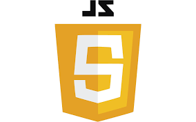

# 🌐 FullStack Web Development Roadmap 🧭

Welcome to my **FullStack Web Development Topics** showcase! 🚀
This project serves as a **quick-access index** for navigating core technologies across **Frontend**, **Backend**, and **Database** development. Whether you're a beginner 🧑‍💻 exploring the web or a developer brushing up your skills, this guide has got you covered!


## 📁 Project Overview

This HTML-based project acts as a centralized **directory-style webpage** presenting structured links to essential full-stack topics. It features:

* ✅ Clean & minimal UI
* 🖼️ Visual representation of each tech using logos
* 🔗 Organized link structure for seamless topic navigation
* 🧭 Categorized sections: Frontend, Backend, and Database


## 🧩 Technologies Covered

### 🎨 FRONTEND

* 🔗 [HTML](./Frontend/html.html) 
* 🨠[CSS](./Frontend/css.html) 
* ⚙️ [JavaScript](./Frontend/javascript.html) 
* 🅱️ [Bootstrap](./Frontend/bootstrap.html) 

### 🛠 BACKEND

* 🐍 [Python](./Backend/python.html) 
* ☕ [Java](./Backend/java.html) 
* 📜 [JavaScript (Node)](./Backend/javascript.html) 

#### 🔧 FRAMEWORKS

* 🌱 [Spring](./Backend/Framework/spring.html) 
* 🐍 [Django](./Backend/Framework/django.html) 
* 🌠[Node.js](./Backend/Framework/nodejs.html) 

### 🗄 DATABASE

* 🛢️ [MySQL](./Database/sql.html) 
* 🃠[MongoDB](./Database/mongoDB.html) 


## 📸 Preview


## 🚀 How to Use

1. Clone the repository

   ```bash
   git clone https://github.com/JerishRaj/fullstack-roadmap.git
   ```
2. Open `index.html` in your browser
3. Click on any topic to explore its content!


## 📚 Ideal For

* 👨‍🎓 Students starting full-stack development
* 🧪 Beginners experimenting with web technologies
* 🧭 Anyone needing a visual topic navigator


## 📌 Future Enhancements

* ✅ Add content pages for each topic
* ✅ Improve UI with modern CSS
* ❗Add search/filter functionality
* 🌐 Host it live via GitHub Pages


## 🙌 Let's Connect

If you find this project helpful or inspiring, don’t forget to ⭐ the repo!


> **Feel free to fork, customize, and expand! Contributions are welcome. 🤝**


